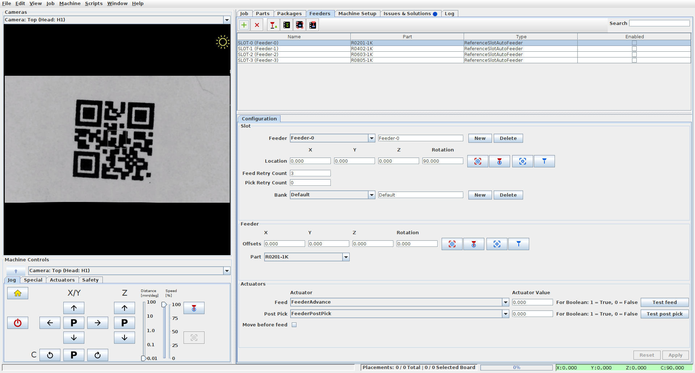

# Feeder Utilitities

This project aims to simplify the process of importing [KiCad](www.kicad.org) PCBs into [OpenPnP](www.openpnp.org) and automating some of the tasks related to Feeder management.

> **WARNING**
> THIS PROJECT IS STILL UNDER ACTIVE DEVELOPMENT.
> USE AT OWN RISK!

## KiCad automation scripts

The [kicad_tools](kicad_tools) directory contains standalone scripts which automate importing of [KiCad](www.kicad.org) PCBs into [OpenPnP](www.openpnp.org). The scripts automate package and parts management in [OpenPnP](www.openpnp.org) based on what the PCB actually uses.

## Feeder automation scripts

The Feeder specific scripts automate the process of creating feeders for parts and identifying the part that a Feeder provides by using the top down camera to read a QR code attached to the Feeder.

### Automation scripts 

The [openpnp](openpnp) directory contains scripts which integrate and run from within [OpenPnP](www.openpnp.org) to manage Feeder creation and part assignment.

The [label_maker](label_maker) directory contains scripts used for generating QR code labels to attach onto Feeders which can be used for part identification.
