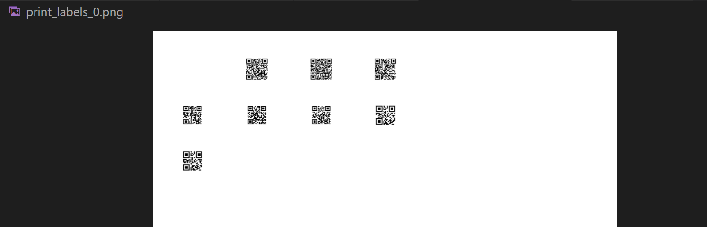
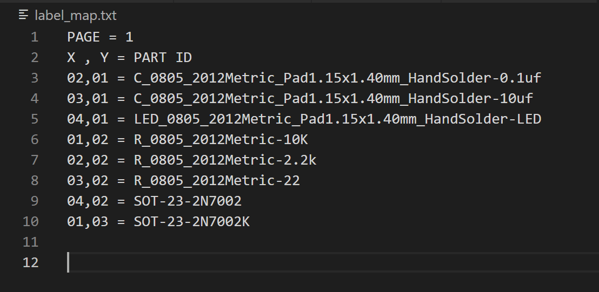

# Label Maker

This directory contains scripts for generating QR code labels for affixing to feeders.

## Generating Sheets of Labels

In order to have the top down cameras recognize the feeders they need to scan a small QR code to know the position and contents of each feeder. Feeder Reader allows you to generate these QR codes and print them on sheets of labels. You can create or adjust a template .json file to match the sheets of labels you want to use. You can also offset where the label starts to print allowing you to print on a partially used sheet of labels. A label map file is also generated so you know the value of each QR code and it's X and Y position on sheet of labels.

To generate the labels use the following commands:

    python3 ./generate_labels.py -p board_example.xml
    
To offset the starting index of the QR codes on the sheet of paper by 2:

    python3 ./generate_labels.py -p board_example.xml -i 2
    
To use a different page template json file add the filename to the end of the command

    python3 ./generate_labels.py -p board_example.xml -i 2 -c neon_labels_0.5inch.json